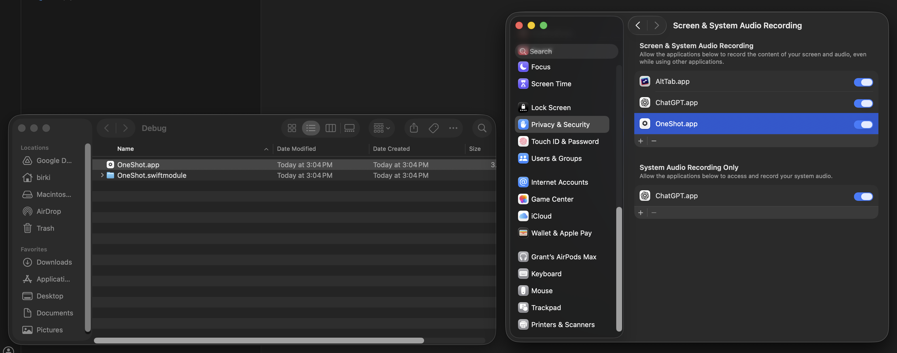

# Contributing to OneShot

Thanks for helping improve OneShot! This project uses the `script/` tools for all common tasks.

## Setup

Install full Xcode 26 and select it with `xcode-select`. Command Line Tools alone are not sufficient.

```bash
script/bootstrap
```

This downloads checksum-pinned versions of XcodeGen, SwiftLint, and SwiftFormat into the ignored `.tmp/tools` directory, then generates the Xcode project. It does not install or modify global Homebrew packages.

## Development

- Build: `script/build`
- Test: `script/test`
- Lint/format checks: `script/lint`
- Run the app (Debug): `script/server`
- Build a universal Release archive: `script/package`
- Verify a Release archive: `script/verify-package`

If you change `project.yml`, run `script/update` to regenerate the Xcode project.

## Release Flow

Versioning is driven by the `VERSION` file. Bump it manually (X.Y.Z) in a commit to `main`.

Releases are created by GitHub Actions when `VERSION` changes on `main`. The workflow:

- Runs the test suite
- Builds and verifies a universal Apple silicon and Intel release zip
- Creates the GitHub release + tag

Release archives use Developer ID signing and notarization when the maintainer provides credentials. Otherwise, packaging applies an ad-hoc bundle signature so integrity verification still succeeds; Gatekeeper may require the user to approve that unnotarized build.

Update the Homebrew cask manually in `grantbirki/homebrew-tap` after each release.

## Permissions (Dev Build)

If the Debug app doesn't appear in Screen Recording permissions after `script/server`, add it manually:

`/Users/$USER/code/oneshot/build/DerivedData/Build/Products/Debug/OneShot.app`



## Guidelines

- Use Swift best practices and keep changes focused.
- Add or update tests for new behavior.
- Update `docs/settings.md` when settings or behavior tied to settings change.
- Prefer the scripts under `script/` over direct tool invocations.
